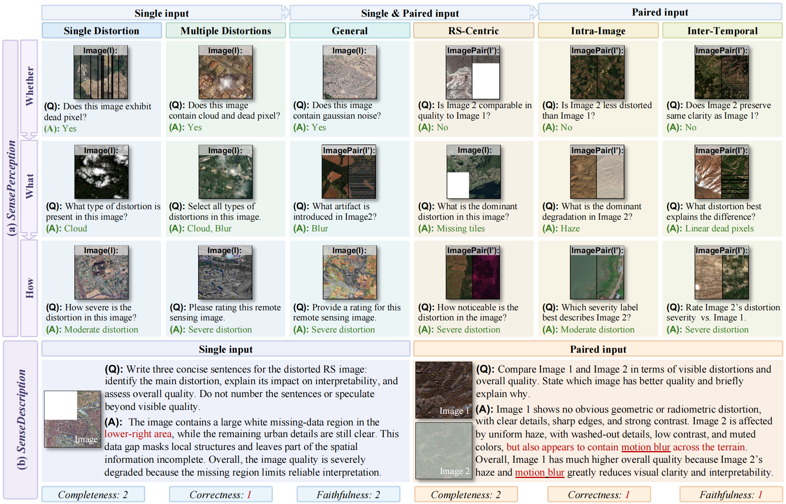
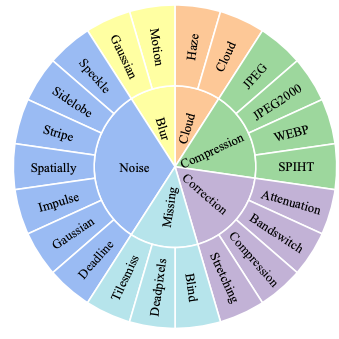

# SenseBench: A Benchmark for Remote Sensing Low-Level Visual Perception and Description in Large Vision-Language Models

> We will regularly maintain and update SenseBench and this repository to foster a comprehensive remote sensing community.
---

## 📢 Latest Updates
- **`02-05-2026`**: We release the code for inference and evaluation.
- **`05-05-2026`**: We release the complete SenseBench benchmark in the [Hugging Face Dataset](https://huggingface.co/datasets/Zhongchenchen/SenseBench). 🔥🔥

---

## ✨ Overview

  

  <b>Figure:</b> Overview of the SenseBench evaluation framework. The upper part shows the <i>SensePerception</i> task taxonomy across input formats, distortion settings, and <i>whether</i>/<i>what</i>/<i>how</i> question types. The lower part illustrates <i>SenseDescription</i> examples for single and paired inputs, where responses are evaluated by <i>completeness</i>, <i>correctness</i>, and <i>faithfulness</i>, with red text indicating incorrect or unsupported statements.

## Distortions

  

  <b>Figure:</b> Supported evaluation distortions in SenseBench. The taxonomy covers optical distortions, SAR distortions, and low-level quality degradations used across the <i>SensePerception</i> and <i>SenseDescription</i> tasks.

Supported evaluation distortions:

| Category | SensePerception | SenseDescription |
| --- | --- | --- |
| Blur | Gaussian, Motion | Gaussian, Motion |
| Cloud | Haze, Real | Haze, Simplex |
| Compression | JPEG, JPEG2000, WEBP, SPIHT | JPEG, JPEG2000, WEBP, SPIHT |
| Correction | Color band attenuation, Color band switch, Compression, Stretching | Color band attenuation, Color band switch, Compression, Stretching |
| Missing | Blind flickering, Line dead pixels, Tiles missing | Blind flickering, Line dead pixels, Tiles missing |
| Noise (optical) | Deadline, Gaussian, Impulse, Spatially correlated, Stripe | Deadline, Gaussian, Impulse, Spatially correlated, Stripe |
| Noise (SAR) | Speckle, Sidelobe | — |

  <b>Note:</b> SenseDescription is defined on the optical subset, while SAR distortions are evaluated in SensePerception.

## 🛠️ Evaluation Workflow

The core inference and evaluation implementations live in `src/`.

> Please refer to [docs/evaluation.md](docs/evaluation.md).

# 📜 Acknowledgements

We gratefully acknowledge the following data sources and platforms that made this project possible:

- **Google Earth** for high-resolution satellite imagery.  
- **Google Earth Engine (GEE)** for planetary-scale geospatial data access and processing tools.
- **Sentinel** satellite data, provided by the European Space Agency (ESA) via the Copernicus Open Access Hub.  
- **Landsat** satellite data, provided by the U.S. Geological Survey (USGS).
- **OpenStreetMap (OSM)** data, contributed by a global community of volunteers and accessed through various mapping services and APIs.

> Use of the Google Earth images must respect the [Google Earth terms of use](https://about.google/brand-resource-center/products-and-services/geo-guidelines/#google-earth). All images and their associated annotations in SenseBench can be used for academic purpose only, any commercial use is prohibited.

# 🏛 License

This project is licensed under the [Creative Commons Attribution 4.0 International License (CC BY 4.0)](https://creativecommons.org/licenses/by/4.0/). You may share and adapt the benchmark materials with appropriate attribution.

For third-party models and datasets used in this repository, please refer to the original source pages and follow their respective licenses and usage terms.
